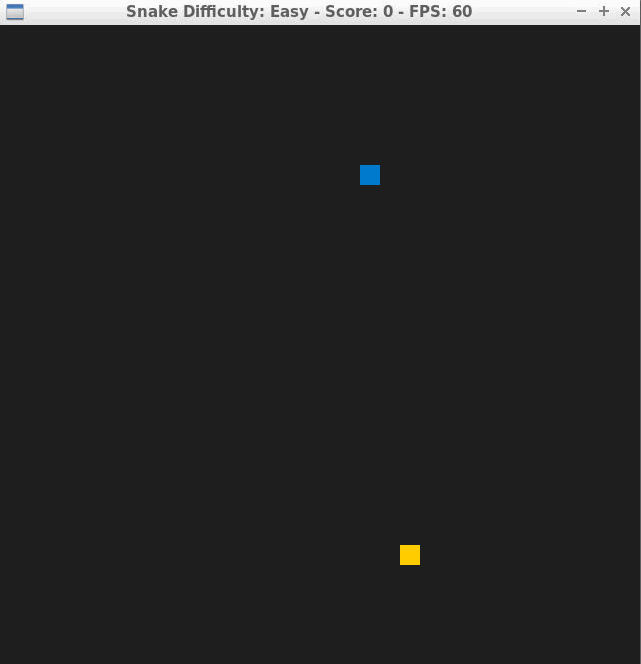

# CPPND: Capstone Snake Game Example

This is a repo of the Capstone project in the [Udacity C++ Nanodegree Program](https://www.udacity.com/course/c-plus-plus-nanodegree--nd213). The code for this repo was inspired by [this](https://codereview.stackexchange.com/questions/212296/snake-game-in-c-with-sdl) excellent StackOverflow post and set of responses. The developer has extended the game with three different levels; easy, medium and hard.

## Dependencies for Running Locally
* cmake >= 3.7
  * All OSes: [click here for installation instructions](https://cmake.org/install/)
* make >= 4.1 (Linux, Mac), 3.81 (Windows)
  * Linux: make is installed by default on most Linux distros
  * Mac: [install Xcode command line tools to get make](https://developer.apple.com/xcode/features/)
  * Windows: [Click here for installation instructions](http://gnuwin32.sourceforge.net/packages/make.htm)
* SDL2 >= 2.0
  * All installation instructions can be found [here](https://wiki.libsdl.org/Installation)
  >Note that for Linux, an `apt` or `apt-get` installation is preferred to building from source. 
* gcc/g++ >= 5.4
  * Linux: gcc / g++ is installed by default on most Linux distros
  * Mac: same deal as make - [install Xcode command line tools](https://developer.apple.com/xcode/features/)
  * Windows: recommend using [MinGW](http://www.mingw.org/)

## Basic Build Instructions

1. Clone this repo.
2. Make a build directory in the top level directory: `mkdir build && cd build`
3. Compile: `cmake .. && make`
4. Run it: `./SnakeGame`.

## Rubric Tasks Achieved

The idea of the developer is to add levels to the game play (easy, medium and hard). The user can select the prefered game play in the beginning. This implementation is done by extending the program source files with `environment.h` and `environment.cpp`. The following rubric tasks are afforded as follows:

1. **Object Oriented Programming: The project uses Object Oriented Programming techniques.**\
*Developer Comment: The added features are introduced within the class Environment.*

2. **Object Oriented Programming: Classes use appropriate access specifiers for class members.**\
*Developer Comment: The data members _difficulty and _borders are to be hidden from the user. This is why they are introduced as private members.*

3. **Object Oriented Programming: Classes use appropriate access specifiers for class members.**\
*Developer Comment: The data members _difficulty and _borders are initialized from the class Environment constructor.*

4. **Object Oriented Programming: Classes abstract implementation details from their interfaces.**\
*Developer Comment: All the getters and the setters within the class Environment have meaningful names and they document their behaviour on the terminal using std::cout.*

5. **Object Oriented Programming: Classes encapsulate behavior.**\
*Developer Comment: The data members _difficulty and _borders are accessible only through their corresponding setters (SetDifficulty() and ReadBorders()) and getters (GetDifficulty() and GetBoarders()).*

6. **Loops, Functions, I/O: The project accepts user input and processes the input.**\
*Developer Comment: The class member function SetDifficulty() fetches the user input to select the game play level. The function is implemented recursively to avoid the bad user input.*

   *The user hast to push 'e' for easy, this level has 0 blocked cells as barriers:*
   

   *The user hast to push 'm' for medium, this level has 68 blocked cells as barriers:*
   

   *The user hast to push 'h' for hard, this level has 144 blocked cells as barriers:*
   

   *In case of entering a bad input (e.g. j), the programm repeats the user inquiry till a proper input is entered:*
   

7. **Loops, Functions, I/O: The project reads data from a file and process the data, or the program writes data to a file.**\
*Developer Comment: The class member function ReadBoard() reads one of the three pre-saved levels maps (easy.txt, medium.txt or hard.txt), saved under the folder levels.*

8. **Memory Management: The project makes use of references in function declarations.**\
*Developer Comment: The class Environment is instantiated and constructed within the main scope and the other classes instances (snake, game and render) are extended with pointers of the class Environment type. There is only one copy of the intance Environment living within main.
The methods Snake::SnakeCell() and Environment::BorderCell() receive thier input values by reference not by value. The method Snake::SnakeCell() in the original implementation was inefficient as it was calling its input by value.*

8. **Loops, Functions, I/O: The project demonstrates an understanding of C++ functions and control structures.**\
*Developer Comment: The original classes members (Snake, Game and Render) implementations were extended properly so that they reach the needed information from the class Environment.*

## CC Attribution-ShareAlike 4.0 International

Shield: [![CC BY-SA 4.0][cc-by-sa-shield]][cc-by-sa]

This work is licensed under a
[Creative Commons Attribution-ShareAlike 4.0 International License][cc-by-sa].

[![CC BY-SA 4.0][cc-by-sa-image]][cc-by-sa]

[cc-by-sa]: http://creativecommons.org/licenses/by-sa/4.0/
[cc-by-sa-image]: https://licensebuttons.net/l/by-sa/4.0/88x31.png
[cc-by-sa-shield]: https://img.shields.io/badge/License-CC%20BY--SA%204.0-lightgrey.svg
